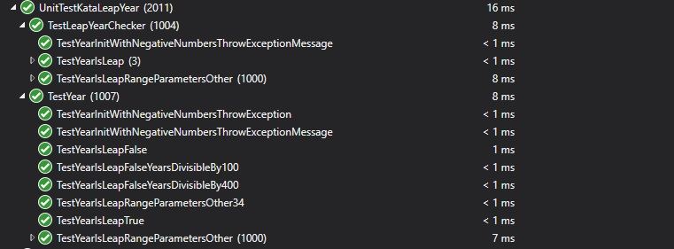

# Kata Leap Years
---
## User Story:

As a user, I want to know if a year is a leap year, So that I can plan for an extra day on February 29th during those years.

## Acceptance Criteria:

- All years divisible by 400 ARE leap years (so, for example, 2000 was indeed a leap year),
- All years divisible by 100 but not by 400 are NOT leap years (so, for example, 1700, 1800, and 1900 were NOT leap years, NOR will 2100 be a leap year),
- All years divisible by 4 but not by 100 ARE leap years (e.g., 2008, 2012, 2016),
- All years not divisible by 4 are NOT leap years (e.g. 2017, 2018, 2019).

### Results:
##### Day 1

##### Day 2

Note: Using TDD take me more training time, I started with this Kata because of a recomedation in a book to feel better with the TDD metodology.